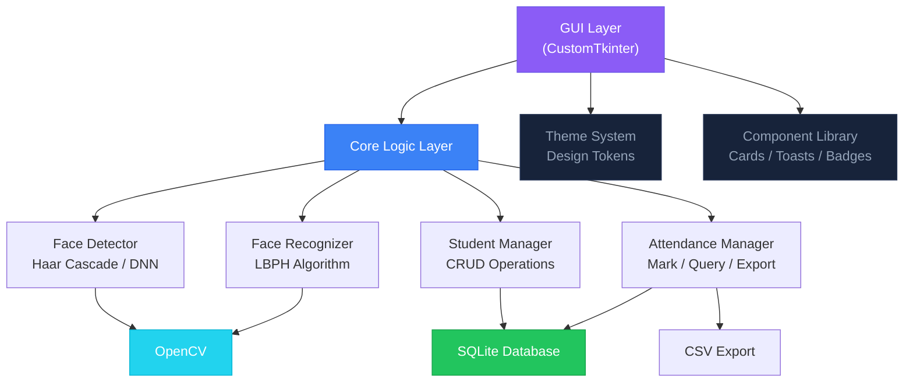
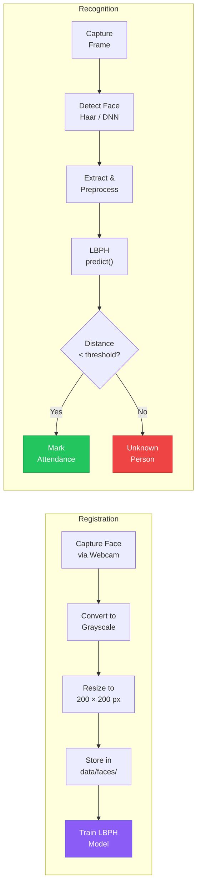
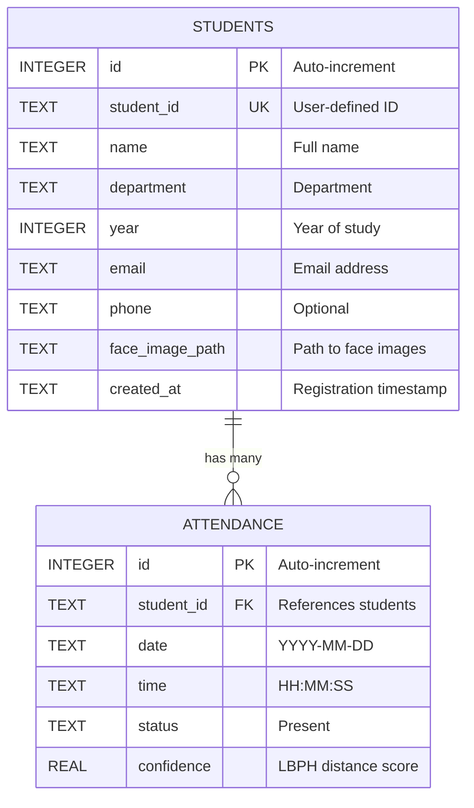

<div align="center">

# Smart Face Recognition Attendance System

**A desktop AI application that automates attendance using real-time face recognition.**

Built with Python · OpenCV · LBPH Algorithm · SQLite · CustomTkinter

---

[Features](#-features) · [Architecture](#-architecture) · [Installation](#-installation) · [Usage Guide](#-usage-guide) · [Database](#-database-schema) · [Testing](#-testing) · [Privacy](#-privacy--consent)

---

</div>

## About

This is a fully functional desktop application that uses **computer vision** and **face recognition** to automatically identify students and mark their attendance in real-time through a webcam feed.

The system captures multiple face samples during registration, trains an LBPH (Local Binary Patterns Histograms) model, and then uses that model to recognize faces during live camera sessions. When a registered person is identified, their attendance is recorded in a local SQLite database with timestamp and confidence score.

All processing happens **entirely offline** — no cloud APIs, no external uploads, no internet required.

---

## Key Capabilities

```
┌─────────────────────────────────────────────────────────────────┐
│                                                                 │
│   Register Students ───► Train Face Model ───► Recognize Faces  │
│         │                      │                      │         │
│    Capture 10 face        LBPH Algorithm         Real-time      │
│    samples via webcam     learns facial           webcam         │
│    with validation        patterns                matching       │
│         │                      │                      │         │
│         └──────────────────────┴──────────────────────┘         │
│                                │                                │
│                    Automatic Attendance Marking                  │
│                    (duplicate-per-day prevention)                │
│                                │                                │
│                    SQLite Database + CSV Export                  │
│                                                                 │
└─────────────────────────────────────────────────────────────────┘
```

---

## Features

### Core Functionality

| Module | What it does |
|:---|:---|
| **Student Registration** | Form-based registration with field validation. Captures 10 face images per student through the webcam for maximum recognition accuracy. |
| **Face Detection** | Real-time face detection using Haar Cascade (default) or DNN SSD detector. Draws professional corner-indicator overlays on detected faces. |
| **Face Recognition** | LBPH-based recognition with configurable confidence threshold. Converts distance scores to percentage for intuitive display. |
| **Attendance Marking** | Automatic attendance recording with `UNIQUE(student_id, date)` constraint to prevent duplicate entries per day. |
| **Records & Search** | Searchable, filterable attendance table with date and student filters. |
| **Analytics Dashboard** | Attendance trend charts, present/absent breakdown, per-student statistics — all rendered with Matplotlib. |
| **CSV Export** | Export filtered attendance data to timestamped CSV files. |
| **Settings Panel** | Configure camera index, recognition threshold, detection method, auto-attendance toggle. |

### Technical Highlights

- **Dual detection backends** — Haar Cascade (zero-config) and DNN Caffe model (higher accuracy)
- **Modular architecture** — Clean separation between GUI, core logic, database, and utilities
- **Input validation** — All student fields validated before registration
- **Error handling** — Graceful camera failure handling, database error recovery
- **Toast notifications** — Floating auto-dismiss notifications for all user actions
- **Privacy by design** — Consent notice, local-only storage, no external data transmission

---

## Architecture



### Design Pattern

The application follows a **layered architecture** with dependency injection:

```
main.py
  └── Creates all service instances (Database, Managers, Detectors)
        └── Injects them into App (GUI root)
              └── App distributes services to each Page via constructor
```

Each page receives only the services it needs. No page directly accesses another page's state.

---

## Technology Stack

| Layer | Technology | Role |
|:---|:---|:---|
| **Language** | Python 3.11+ | Core runtime |
| **GUI** | CustomTkinter | Modern dark-themed desktop framework |
| **Vision** | OpenCV 4.8+ | Face detection, image processing, camera I/O |
| **Recognition** | LBPH (opencv-contrib) | Local Binary Patterns Histograms face matching |
| **Database** | SQLite3 | Embedded relational database (zero-config) |
| **Charts** | Matplotlib | Attendance trend, donut, and bar visualizations |
| **Images** | Pillow | Format conversion between OpenCV and Tkinter |
| **Numerics** | NumPy | Array operations for image processing |

---

## Project Structure

```
Face Recognition Attendance System/
│
├── main.py                         ← Application entry point
├── requirements.txt                ← Python dependencies
├── LICENSE                         ← MIT License
│
├── core/                           ← Business logic (no GUI imports)
│   ├── face_detector.py            ← Haar + DNN face detection
│   ├── face_recognizer.py          ← LBPH train/predict/threshold
│   ├── student_manager.py          ← Student registration + validation
│   └── attendance_manager.py       ← Attendance CRUD + stats + export
│
├── gui/                            ← Presentation layer
│   ├── theme.py                    ← Design system (colors, fonts, spacing)
│   ├── components.py               ← Reusable widgets (cards, toasts, badges)
│   ├── app.py                      ← Root window + sidebar navigation
│   ├── dashboard.py                ← Analytics dashboard
│   ├── registration.py             ← Student registration + face capture
│   ├── recognition.py              ← Live face recognition
│   ├── attendance_view.py          ← Attendance records table
│   ├── statistics.py               ← Charts and analytics
│   ├── settings.py                 ← Configuration panel
│   └── about.py                    ← System info + privacy notice
│
├── database/
│   └── database.py                 ← SQLite connection + schema + queries
│
├── utils/
│   ├── config.py                   ← Centralized constants + settings I/O
│   ├── validators.py               ← Input validation functions
│   └── helpers.py                  ← Date/time, CSV, download utilities
│
├── tests/                          ← Unit tests (pytest)
│   ├── test_validators.py
│   ├── test_database.py
│   ├── test_student_manager.py
│   ├── test_attendance_manager.py
│   └── test_csv_export.py
│
└── scripts/
    └── create_demo_data.py         ← Generate sample data for testing
```

---

## Installation

### Prerequisites

- Python 3.11 or higher — [Download](https://www.python.org/downloads/)
- A webcam (built-in or USB)
- Windows 10/11 (also works on macOS and Linux)

### Setup

```bash
# Clone or download the project
cd "Face Recognition Attendance System"

# Create and activate a virtual environment
python -m venv venv
venv\Scripts\activate          # Windows
# source venv/bin/activate     # macOS / Linux

# Install all dependencies
pip install -r requirements.txt

# Launch the application
python main.py
```

> **Windows troubleshooting:** If `opencv-contrib-python` fails to install, run `pip install --upgrade pip` first. If you get a DLL error, install the [Visual C++ Redistributable](https://aka.ms/vs/17/release/vc_redist.x64.exe).

---

## Usage Guide

### 1. Register a Student

Navigate to **Register** from the sidebar.

```
Fill in student details          Start the webcam
        │                              │
        ▼                              ▼
┌──────────────┐            ┌──────────────────┐
│ Student ID   │            │  Live camera      │
│ Full Name    │            │  preview with     │
│ Department   │            │  face detection   │
│ Year         │            │  overlay          │
│ Email        │            │                   │
│ Phone        │            │  [Capture Face]   │
└──────────────┘            └──────────────────┘
                                    │
                            Capture 10 samples
                            (vary head angle slightly)
                                    │
                            Click [Register Student]
```

### 2. Mark Attendance

Navigate to **Recognition** from the sidebar.

```
Click [Start Camera]
        │
        ▼
   Camera feed with face detection
        │
        ▼
   Face matched? ──Yes──► Attendance recorded automatically
        │                         │
        No                        ▼
        │                  ┌─────────────────┐
        ▼                  │ Name: Rahul S.  │
   "Unknown" label         │ ID: CSE-2024-01 │
                           │ Confidence: 94% │
                           │ Status: Present │
                           └─────────────────┘
```

The system prevents duplicate attendance entries for the same student on the same day.

### 3. View & Export Records

Navigate to **Attendance** → search by name/ID, filter by date → click **Export CSV**.

---

## Face Recognition Workflow



### How LBPH Works

LBPH (Local Binary Patterns Histograms) is a texture-based face recognition algorithm:

1. **Divide** the face image into small cells (e.g., 8×8 pixels)
2. **Compare** each pixel to its neighbors — encode as a binary pattern
3. **Build** a histogram of these patterns for each cell
4. **Concatenate** all histograms into a single feature vector
5. **Compare** feature vectors using chi-square distance

A **lower distance** means a better match. The default threshold is `85.0`.

---

## Database Schema



**Key constraint:** `UNIQUE(student_id, date)` on the attendance table prevents duplicate entries per student per day.

---

## Configuration

All settings can be adjusted from the in-app **Settings** page or by editing `utils/config.py`:

| Parameter | Default | Description |
|:---|:---:|:---|
| `CAMERA_INDEX` | `0` | Webcam device index (try 0, 1, 2...) |
| `FACE_MATCH_THRESHOLD` | `85.0` | LBPH distance threshold — lower = stricter matching |
| `NUM_FACE_SAMPLES` | `10` | Number of face images captured during registration |
| `FACE_IMAGE_SIZE` | `200×200` | All face images are resized to this before processing |
| `FACE_DETECTION_CONFIDENCE` | `0.5` | Minimum confidence for DNN face detector |

---

## Testing

The project includes a comprehensive test suite using `pytest`:

```bash
python -m pytest tests/ -v
```

| Test Module | Coverage |
|:---|:---|
| `test_validators.py` | Input validation (name, email, phone, student ID) |
| `test_database.py` | Database creation, CRUD operations, constraints |
| `test_student_manager.py` | Student registration, duplicate prevention |
| `test_attendance_manager.py` | Attendance marking, daily stats, duplicate prevention |
| `test_csv_export.py` | CSV export formatting and file creation |

---

## Limitations

| Limitation | Explanation |
|:---|:---|
| **Lighting sensitivity** | LBPH works best in consistent lighting conditions. Performance degrades in very dark or backlit environments. |
| **Frontal faces only** | Detection is optimized for frontal face views. Profile or heavily angled faces may not be detected. |
| **Single camera** | The application supports one webcam at a time. |
| **No encryption** | Face images are stored as plain files. Suitable for a college project, not for production deployment. |
| **Not anti-spoof** | No liveness detection — a printed photo could potentially be recognized. |

---

## Future Improvements

- Deep learning face recognition (FaceNet / ArcFace) for higher accuracy
- Face anti-spoofing with liveness detection
- Multi-camera support
- Admin authentication and role-based access
- Face data encryption at rest
- Email/SMS notifications for attendance reports
- Batch registration from existing photos
- Cloud backup (opt-in, encrypted)

---

## Privacy & Consent

> This application is designed for **authorized attendance use only**.
>
> - All face data is processed and stored **locally on this device**
> - No images or biometric data are uploaded to external servers
> - The camera activates **only** when the user explicitly clicks "Start Camera"
> - Appropriate consent must be obtained before registering or recognizing individuals
>
> This is an **educational project** demonstrating face recognition technology. It is not intended for covert surveillance or unauthorized monitoring.

---

## Troubleshooting

| Problem | Solution |
|:---|:---|
| `ModuleNotFoundError: cv2` | Run `pip install opencv-contrib-python` |
| Camera not opening | Change Camera Index in Settings (try 0, 1, 2) |
| "No face detected" | Ensure good lighting and face the camera directly |
| Low recognition accuracy | Capture more samples, lower the threshold in Settings |
| `DLL load failed` (Windows) | Install [Visual C++ Redistributable](https://aka.ms/vs/17/release/vc_redist.x64.exe) |
| Database locked error | Close other instances of the application |

---

## License

This project is licensed under the MIT License. See [LICENSE](LICENSE) for details.

---

<div align="center">

Built with Python, OpenCV, and open-source technologies.

</div>
